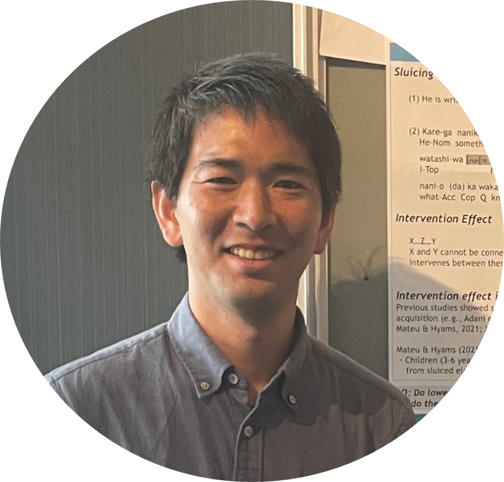

```{=html}
<style type="text/css">
  body, td {
    font-size: 16px;
  }

  code.r {
    font-size: 12px;
  }

  pre {
    font-size: 12px;
  }
</style>
```

```{r echo = FALSE, out.width = "35%", out.extra='style="float:left; padding:50px"'}

```

<br>
<br>
<br>
I am a PhD student at Waseda University (Japan). I study Second Language Acquisition and Second Language Processing.

My CV can be downloaded [here](https://) (last updated: 11 September 2024).

Also follow me on:  <a href='https://researchmap.jp/atsushimiura' target='_blank'></a> <a href='https://x.com/AtsushiM_SLA' target='_blank'></a> <a href="https://orcid.org/0000-0002-0936-4738"> <a href='https://www.researchgate.net/profile/Atushi-Miura' target='_blank'></a> <br>

<br>
<br>
<br>
<br>
<br>

### Research interests

   **Second Language Acquisition**

   **Event-related Potential (ERP)** <br>

<br>

### Education

   **2024 - Present**   **PhD student, [Waseda University](https://www.waseda.jp/top/), Japan.**

                Supervisors: [Dr. Shiro Ojima](https://celese.jp/ja/faculty/ojima/)

   **2018 - 2020**   **Master of Arts, [Kanagawa University](https://www.kanagawa-u.ac.jp/), Japan.**

                Dissertation supervisor: [Dr Maki Yamane](https://www.kanagawa-u.ac.jp/professor/details/details_101673.html)

   **2014 - 2018**   **Bachelor of Arts, [Kanagawa University](https://www.kanagawa-u.ac.jp/), Japan.**

                Thesis supervisor: [Professor Kazuyuki Takahashi](https://www.kanagawa-u.ac.jp/professor/details/details_101509.html)

<br>

------------------------------------------------------------------------

icons by <a href="https://icons8.com">Icons8
